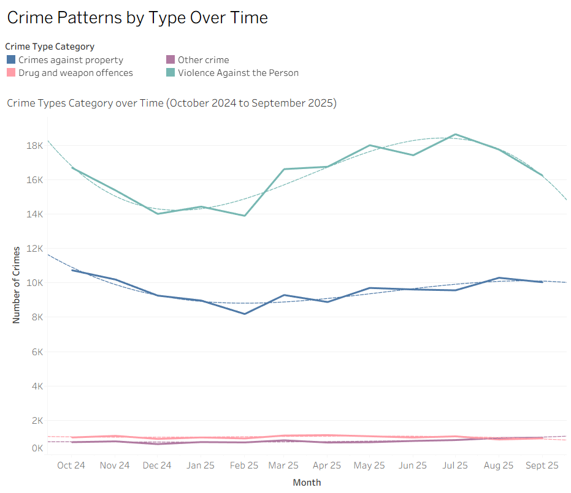

# Crime Analysis Project

## Executive Summary
This project analyses **12 months of recorded crime data** across **Northumbria, Durham, and Cleveland** using **population- and area-adjusted metrics**. Adjusting for geographic and population context prevents misleading conclusions based solely on raw totals.  

The analysis identifies **Violence Against the Person** as the most prevalent and seasonally significant crime type across all three constabularies. Understanding these patterns and their drivers is critical for **safeguarding, operational planning, and workforce deployment**.

### Key Findings
- **Violence Against the Person** is driven largely by **violence and sexual offences**, which consistently represent the largest sub-category.  
- The dataset lacks victim-level detail, limiting the ability to assess individual risk or target safeguarding activity.  
- Population-adjusted crime rates highlight areas where resources should be focused to ensure **fair and effective deployment**.

## Recommendations

### Operational Activity
- **Cleveland Police:** Focus resources on **high-density urban areas** where crime per square mile is highest.  
- **Northumbria and Durham:** Use **mobile or targeted patrols in rural areas** to efficiently address dispersed crime patterns.  
- Incorporating **population-adjusted crime rates** into planning can reduce bias from raw totals and support fairer resource allocation.

### Crime Classification & Data Integrity
- Refine classification of violent and sexual offences, including assault, domestic violence, and various sexual crimes, to improve understanding of severity and impact.  
- Accurate classification is essential; high-volume or similar crime types may otherwise lead to misallocation.  
- Regular **audits and clear guidelines** improve data reliability, enabling better decision-making.

### Seasonality & Workforce Planning
- Crime trends, especially Violence Against the Person, are **seasonal**, affecting operational coverage.  
- Workforce planning should balance **peak crime periods** with **staff holiday requests**.  
- A **fair, transparent holiday allocation system** helps maintain coverage and staff satisfaction.  

### Conclusion
Accurate crime categorisation combined with an understanding of seasonal trends enables **efficient resource deployment**. Proactive planning for seasonal spikes reduces strain on teams and ensures **public safety** is maintained.

---

## Data Files
- Raw Crime Data – Merged Crime Data 10-2024 to 09-2025
- Raw Crime Data - Additional table - Constabulary Info

## Project Presentation
- [Full Project Presentation (PDF)](./Project%20Presentation%20-%20Crime%20Data.pdf)

## Future Directions
- Designing **workforce planning dashboards** for HR to optimise staffing. 
- Incorporate **cybercrime datasets** to extend analysis into digital offences.  
- Explore **related datasets** deprivation indices, weather data, or public events, to test additional hypotheses about crime drivers.  
- Extend the analysis period and develop a **predictive element**.
- Enhance spatial and temporal analyses to identify hotspots and constabulary-specific patterns, **enabling more targeted insights**.

